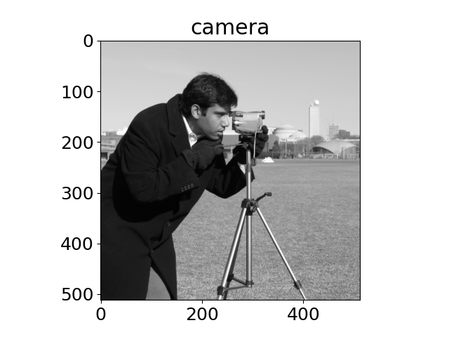

<!-- Your Project title, make it sound catchy! -->

# Project title

<!-- You may wish to provide an image -->


Sample Image

<!-- Provide a short description to your project -->

## Description

Lorem ipsum dolor sit amet, consectetur adipiscing elit. Nam vitae pulvinar
mauris. Praesent sollicitudin rutrum mauris sed congue. Donec vel orci elit.
Phasellus luctus sodales elementum. Donec lacinia semper lorem, volutpat
molestie arcu bibendum mollis. Nulla nec massa vitae sapien varius vulputate
vel vitae ex. Curabitur convallis iaculis elit at faucibus. Sed eget facilisis
orci, ut consequat neque.

<!-- What should the students going through your exemplar learn -->

## Learning Outcomes

- Skill 1
- Skill 2
- Skill 3

<!-- How long should they spend reading and practising using your Code.
Provide your best estimate -->

| Task       | Time    |
| ---------- | ------- |
| Reading    | 3 hours |
| Practising | 3 hours |

## Requirements

<!--
If your exemplar requires students to have a background knowledge of something
especially this is the place to mention that.

List any resources you would recommend to get the students started.

If there is an existing exemplar in the ReCoDE repositories link to that.
-->

### Academic

<!-- List the system requirements and how to obtain them, that can be as simple
as adding a hyperlink to as detailed as writting step-by-step instructions.
How detailed the instructions should be will vary on a case-by-case basis.

Here are some examples:

- 50 GB of disk space to hold Dataset X
- Anaconda
- Python 3.11 or newer
- Access to the HPC
- PETSc v3.16
- gfortran compiler
- Paraview
-->

### System

<!-- Instructions on how the student should start going through the exemplar.

Structure this section as you see fit but try to be clear, concise and accurate
when writing your instructions.

For example:
Start by watching the introduction video,
then study Jupyter notebooks 1-3 in the `intro` folder
and attempt to complete exercise 1a and 1b.

Once done, start going through through the PDF in the `main` folder.
By the end of it you should be able to solve exercises 2 to 4.

A final exercise can be found in the `final` folder.

Solutions to the above can be found in `solutions`.
-->

## Getting Started

<!-- An overview of the files and folder in the exemplar.
Not all files and directories need to be listed, just the important
sections of your project, like the learning material, the code, the tests, etc.

A good starting point is using the command `tree` in a terminal(Unix),
copying its output and then removing the unimportant parts.

You can use ellipsis (...) to suggest that there are more files or folders
in a tree node.

-->

## Project Structure

```log
.
├── notebooks
│   ├── ex1.ipynb
├── src
|   ├── file1.py
|   ├── file2.cpp
|   ├── ...
│   └── data
├── docs
└── test
```

<!-- Adjust this text and LICENCE.md file (e.g. years) as needed -->

## License

This project is licensed under the [BSD-3-Clause license](LICENSE.md)
